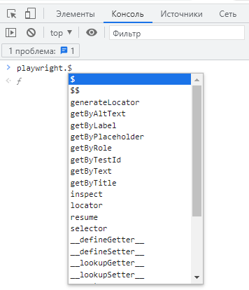
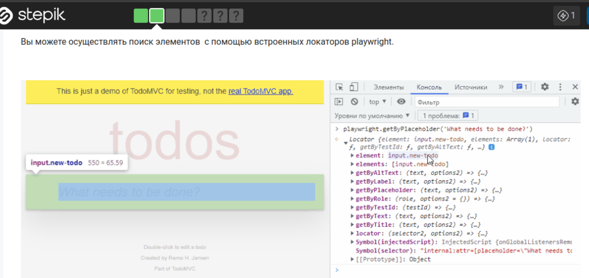
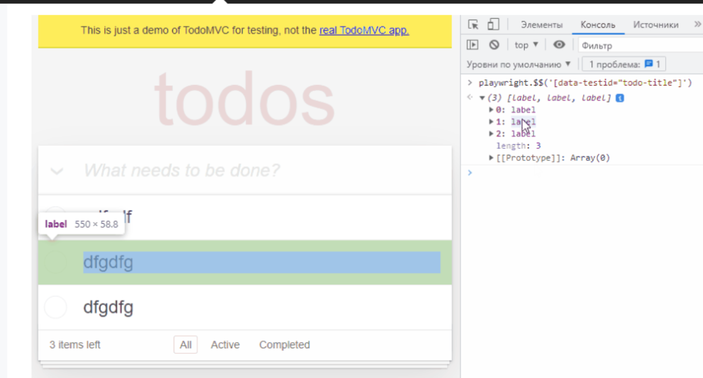

## Python Playwright

### Запись скрипта с помощью Codegen
Это команда откроет два окна:
- Браузер Chromium
- Playwright Inspector  
Далее вы можете выполнить необходимое действие по сценарию в браузере, а codegen запишет и сгенерирует код для выполняемого вами действия.
```bash
playwright codegen demo.playwright.dev/todomvc/#/
```

Размер открываемого окна браузера указывается через аргумент --viewport-size
```bash
playwright codegen --viewport-size=800,600 https://demo.playwright.dev/todomvc/#/
```

Можно сразу указать файл, в который будете сохранен записанный код, добавив -о или --output и указав имя файла.
```bash
playwright codegen -o example_lesson.py https://demo.playwright.dev/todomvc/#/
```

### Playwright CLI

Запуск в режиме headed
```bash
pytest --headed
```
Запускать тесты в другом браузере chromium, firefox или webkit
```bash
pytest --headed --browser webkit --browser firefox
```

Запуск тестов в браузерах Chrome и Edge, установленных непосредственно в системе
```bash
pytest --browser-channel=msedge --headed
```

Замедление выполнения теста на указанное количество миллисекунд
```bash
pytest --headed --slowmo 1000
```
Имитации поведения браузера для определенного устройства [Список](https://github.com/microsoft/playwright/blob/main/packages/playwright-core/src/server/deviceDescriptorsSource.json)
```bash
pytest --headed --device="iPhone 13 Mini"
```

Каталог для артефактов, создаваемых тестами (по умолчанию: test-results) используется вместе с trace и.т.д.
```bash
pytest --headed --device="iPhone 13 Mini" --output=results
```

Записывать ли трассировку для каждого теста. on, off или retain-on-failure (по умолчанию: off)
```bash
pytest --headed --device="iPhone 13 Mini" --output=results --tracing=on
```
Просмотр трасировки 
```bash
playwright show-trace trace.zip
```

Записывать ли видео для каждого теста. on, off или retain-on-failure (по умолчанию: off)
```bash
 pytest --headed --device="iPhone 13 Mini" --video=on
```

Записывать снимок экрана после каждого теста. on, off или only-on-failure (по умолчанию: off).
```bash
pytest --headed --device="iPhone 13 Mini" --screenshot=on
```

Записывать скриншот всей страницы при ошибке. По умолчанию снимается только область просмотра. Требуется, чтобы параметр --screenshot был включен (по умолчанию: off).
```bash
pytest --headed --device="iPhone 13 Mini" --screenshot=on --full-page-screenshot
```

### Locators

ID
```python
page.locator("#new-todo").click()
page.locator("//*[@id='new-todo']").click()
```

Class
```python
page.locator(".new-todo").click()
page.locator("//*[@class='new-todo']").click()

page.locator("css=.first-class.another-class").click()
page.locator("xpath=//div[contains(@class, 'first-class') and contains(@class, 'another-class')]").click()
```

Attributes
```python
page.locator("[placeholder='Your email address']").click()
page.locator("//*[@placeholder='Your email address']").click()
```

Combinators

descendant
```python
page.locator(".container p").click()
```

child
```python
page.locator(".container > p").click()
```

Pseudoclasses

```python
page.locator("td:right-of(td p:text('Software engineer'))")
page.locator("td:left-of(td p:text('Software engineer'))")
page.locator("td:above(td p:text('Consultant'))")
page.locator("td:below(td p:text('Consultant'))")
page.locator("td:near(td p:text('Consultant'))")
page.locator("td:below(td p:text('Software engineer'), 100)")
```

conditions

```python
page.locator('button:has-text("Log in"), button:has-text("Sign in")').click()
```

N element
```python
page.locator("button").locator("nth=0").click()
page.locator("button").locator("nth=-1").click()
```

Only visible
```python
page.locator('div:has-text("Card")').click()
```

get_by_*

```python
page.get_by_text("switch checkbox").click()
page.get_by_text("switch checkbox",exact=True).click()

page.get_by_label("Email address").fill("qa@example.com")

page.get_by_placeholder("password")

page.get_by_test_id('todo-title').click()

page.get_by_alt_text('logo').click()

page.get_by_title("username").fill("Anton")

page.get_by_role("button", name="Submit").click()
```

locator.or_

```python
def test_or(page):
    selector = page.locator("input").or_(page.locator("text"))
    selector.fill("Hello Stepik")

def test_locator_and(page):
    page.goto("https://zimaev.github.io/locatorand/")
    selector = page.get_by_role("button", name="Sing up").and_(page.get_by_title("Sing up today"))
    selector.click()
```

locator chain

```python
page.locator("#navbarNavDropdown >> li:has-text('Company')").click()
```

or

```python
nav_bar = page.locator('div#navbarNavDropdown')
nav_bar.locator("li:has-text('Company')").click()
```

Filtration

```python
page.locator("li").filter(has_text='Company').click()

page.locator('li').filter(has=page.locator('.dropdown-toggle')).click()

row_locator.filter(has_not=page.get_by_role("button")).count()

row_locator.filter(has_not_text="helicopter")

row_locator
    .filter(has_text="text in column 1")
    .filter(has=page.get_by_role("button", name="column 2 button"))
    .click()

```

Several elements
количество элементов, соответствующих указанному селектору
```python
page.get_by_role("button").count()
```
Для того чтобы взаимодействовать с конкретным элементом из списка, используйте метод nth() с указанием индекса нужного вам элемента. Указывается именно индекс, а не порядковый номер, по этому счет ведется с 0-го индекса. nth(0)выбирает первый элемент. Учитывайте это при выборе элемента.
```python
page.get_by_role("listitem").nth(1)
```
locator.first, locator.last

locator.all() 
```python
page.goto('https://zimaev.github.io/checks-radios/')
checkboxes = page.locator("input")
for checkbox in checkboxes.all():
    checkbox.check()
```

### Screenshot

скриншот
```python
page.screenshot(path="screenshot.png")
```

Скриншот всей страницы
```python
page.screenshot(path="screenshot.png", full_page=True)
```

Задает формат изображения. Доступные варианты включают 'jpeg' и 'png'. По умолчанию 'png'.
```python
page.screenshot(path="example.jpeg", type="jpeg")
```

 Качество сжатия изображения для формата 'jpeg'. Должно быть число от 0 до 100. По умолчанию не определено.
```python
page.screenshot(path="example.jpeg", type="jpeg", quality=80)
```

Задает область для создания скриншота, указав координаты x, y, ширину и высоту. 
```python
page.screenshot(path="clipped_image.png", clip={"x": 50, "y": 0, "width": 400, "height": 300})
```

Задает максимальное время ожидания (в миллисекундах) перед созданием скриншота. Установите значение как "0", чтобы ждать неограниченное время. По умолчанию 30000 миллисекунд (30 секунд).
```python
page.screenshot(path="timeout_example.png", timeout=10000)
```

### PWDEBUG и Playwright Inspector

Запуск теста в Playwright Inspector в режиме дебаг, перед тестовой командой префикс PWDEBUG=1
```bash
PWDEBUG=1 pytest -k 'test_todo'
```

Можно так же в коде использовать
```python
page.pause()
```

После запуска в режиме отладки можно в console искать локаторы



Для того чтобы искать элементы используя селекторы css и xpath
```
playwright.$(selector): выделяет первое вхождение селектора.
playwright.$$(селектор): выделяет все вхождения селектора. 
```


переместит во вкладу элементы и отобразит данный селектор в DOM
```
playwright.inspect(selector)
playwright.inspect('input')
```


В качестве закрепления полученных знаний и получения практических навыков используйте следующие тестовые сайты

 

Чек-боксы и переключатели
https://webdriveruniversity.com/Dropdown-Checkboxes-RadioButtons/index.html

https://the-internet.herokuapp.com/checkboxes

https://demoqa.com/checkbox

https://demoqa.com/radio-button

 

Выпадающий список
https://the-internet.herokuapp.com/dropdown

 
Кнопки
https://demoqa.com/buttons

https://letcode.in/buttons

 

Загрузка и скачивание  
https://demoqa.com/upload-download

https://practice-automation.com/file-download/

https://practice-automation.com/file-upload/

 

Всплывающие окна и алерты
https://webdriveruniversity.com/Popup-Alerts/index.html

https://demoqa.com/modal-dialogs

https://practice-automation.com/popups/

 

Таблицы
https://the-internet.herokuapp.com/tables

https://demoqa.com/webtables

http://uitestingplayground.com/dynamictable

 

Авторизация
https://the-internet.herokuapp.com/login

https://webdriveruniversity.com/Login-Portal/index.html

 

Заполнение форм 
https://webdriveruniversity.com/Contact-Us/contactus.html

https://demoqa.com/automation-practice-form

https://practice-automation.com/form-fields/

https://letcode.in/edit

https://www.globalsqa.com/samplepagetest/

 

Тестовые сайты
https://www.saucedemo.com/

https://demo.applitools.com/